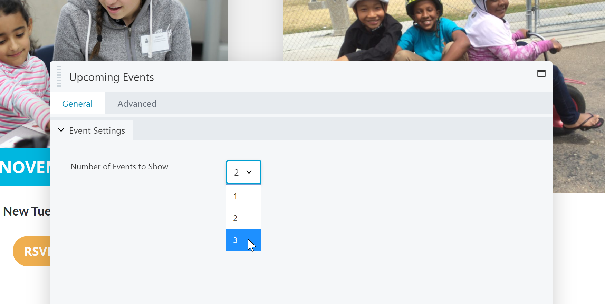

# SDRT Custom Beaver Builder Modules
Custom Beaver Builder Modules for the SDRT website.

This functionality plugin just houses custom Beaver Builder modules. The separation from the SDRT Custom Functions module is useful just in the case that we stop using Beaver Builder some day all the functionality is isolated to just this one plugin. 

Currently, this plugin has the following custom modules:

## Upcoming Events
This module shows the upcoming events from the Events Calendar plugin. It shows them in a CSS Grid responsively. It can show either 1, 2, or 3 events. 

This module is in the "General" section of the builder. 

Screenshots:

### Frontend
_The frontend view of this module showing 2 upcoming events_

### Options
_The options available within the builder_
